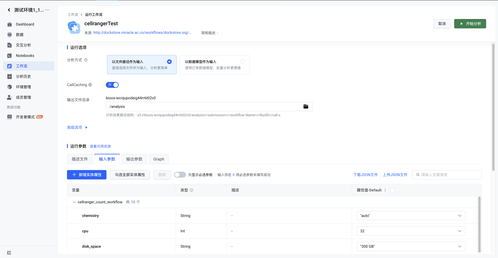
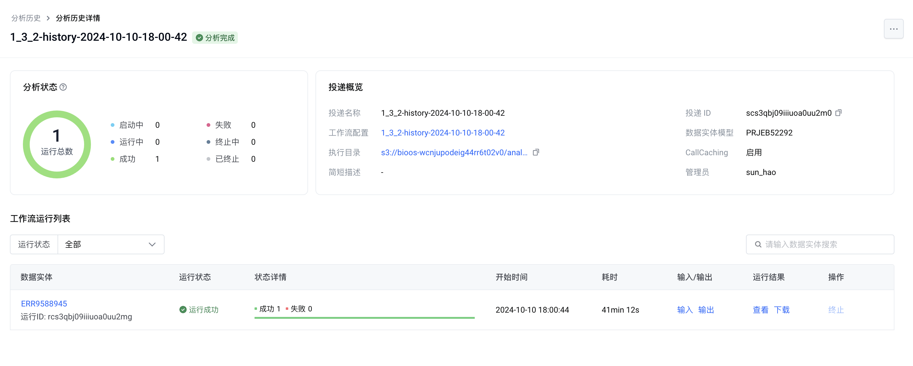
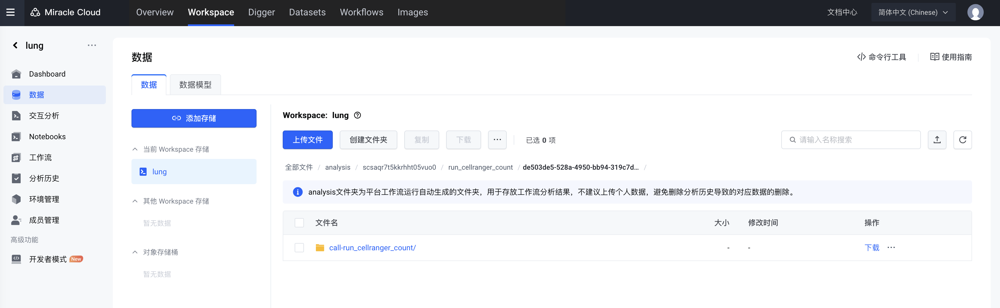
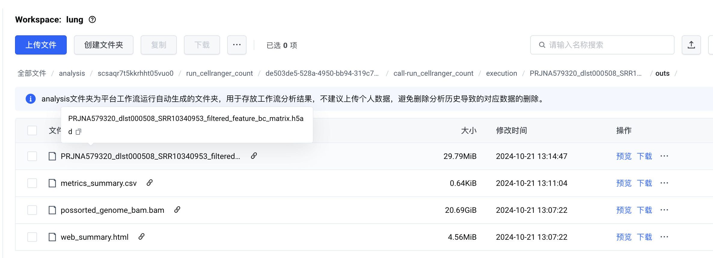
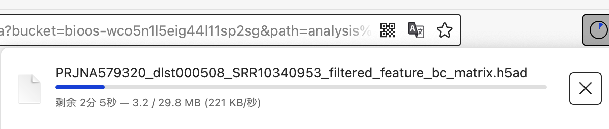

# scRNA-seq
您的位置：source: `{{ page.path }}`

# 10X Genomics scRNA-seq
为了便于工作流的可重复性，我们推荐您使用json文件来描述和存档您的实验参数。

# 写在前面
这里会涉及到BioOS文件管理的相关内容，请参考[BioOS文件管理（待完善）](../BioOS/README.md)

在这里，我们假设您已经对平台的使用有了基础的了解，并创建了必要的文件夹。如果还没有，请参考[动手学BioOS计算](../BioOS/README.md)

请注意，我们不要求您对json文件、WDL文件或者云计算有深入的了解，您只需要知道如何使用json文件来描述您的实验参数。我们的目标是您只需要知道如何“复制、粘贴”就能完成您的实验。

让我们开始吧！

## 对于一个典型的10X Genomics scRNA-seq实验，我们推荐使用如下的json文件：
```json
{
  "cellranger_count_workflow.chemistry": "auto",
  "cellranger_count_workflow.cpu": 32,
  "cellranger_count_workflow.disk_space": "300 GB",
  "cellranger_count_workflow.fastq_file_paths": null,
  "cellranger_count_workflow.memory": "225 GB",
  "cellranger_count_workflow.no_bam": "False",
  "cellranger_count_workflow.reference_genome_tar_gz": "s3://bioos-wcnjupodeig44rr6t02v0/Example_10X_data/RAW/refdata-cellranger-GRCh38-3.0.0.tar.gz",
  "cellranger_count_workflow.run_id": null,
  "cellranger_count_workflow.sample": null,
  "cellranger_count_workflow.secondary": "False"
}
```
看起来很复杂，但没关系。仔细观察，您会发现，这个json文件的部分参数已经自动设置好了，在大部分情况下，您只需要依次填写您自己的参数即可。

（markdown格式 引用 可折叠 或者 展开上标引用）注释：作为快速上手教程，我们不对具体的参数做出解释，具体的参数的解释请参考[10X Genomics官方文档](https://support.10xgenomics.com/single-cell-gene-expression/software/pipelines/latest/using/count)，在支持文档，我们也会对一些关键参数做出解释。

这里我们给出了填写示例：
- 注意这几个部分1️⃣`cellranger_count_workflow.fastq_file_paths` 2️⃣`cellranger_count_workflow.run_id` 3️⃣`cellranger_count_workflow.sample`

```json
{
  "cellranger_count_workflow.chemistry": "auto",
  "cellranger_count_workflow.cpu": 32,
  "cellranger_count_workflow.disk_space": "300 GB",
  "cellranger_count_workflow.fastq_file_paths": [
    "s3://bioos-wcnjupodeig44rr6t02v0/Example_10X_data/ERR8048237/5891STDY8062334_S1_L001_I1_001.fastq.gz",
    "s3://bioos-wcnjupodeig44rr6t02v0/Example_10X_data/ERR8048237/5891STDY8062334_S1_L001_R1_001.fastq.gz",
    "s3://bioos-wcnjupodeig44rr6t02v0/Example_10X_data/ERR8048237/5891STDY8062334_S1_L001_R2_001.fastq.gz"
  ],
  "cellranger_count_workflow.memory": "225 GB",
  "cellranger_count_workflow.no_bam": "False",
  "cellranger_count_workflow.reference_genome_tar_gz": "s3://bioos-wcnjupodeig44rr6t02v0/Example_10X_data/RAW/refdata-cellranger-GRCh38-3.0.0.tar.gz",
  "cellranger_count_workflow.run_id": "ERR8048237",
  "cellranger_count_workflow.sample": "5891STDY8062334",
  "cellranger_count_workflow.secondary": "False"
}
```

<pre class="line-numbers"><code class="language-json">
{
  "key": "value",
  "another_key": "another_value"
}
</code></pre>

是的，就是这么简单。我们添加了文件路径，并填写了run_id和sample。这和您在本地计算的参数填写逻辑是一样的。我们已经准备好了，现在就提交任务吧！

## 提交任务
让我们回到BioOS平台，来到我们的cellrangerTest页面。试试看，找到页面上的"运行参数"选项卡>输入参数>"上传JSON文件"，将您的json文件上传。

然后，点击页面上的绿色按钮"开始分析"，等待任务完成。

<figure style="
  text-align: center;
  display: inline-block;
  border: 2px solid #00326e; /* 边框颜色，可根据需要调整 */
  border-radius: 10px; /* 圆角半径 */
  padding: 10px; /* 内边距，确保内容不紧贴边框 */
  background-color: #f9f9f9; /* 背景颜色，可选 */
">
  
  <figcaption style="
    font-size: 0.9em; /* 字体大小，稍小于正文 */
    font-weight: bold; /* 加粗 */
    text-decoration: underline; /* 下划线 */
    color: inherit; /* 颜色与父元素一致 */
    margin-top: 8px; /* 图片与注释之间的间距 */
  ">
    注意右上角的绿色按钮，点击即可开始分析，并在3秒后自动跳转到分析历史界面。
  </figcaption>
</figure>


## 查看结果
任务完成后，您可以在分析历史中看到您的任务。点击任务名称，进入任务详情页面。在任务详情页面，您可以查看/下载结果。

<figure style="
  text-align: center;
  display: inline-block;
  border: 2px solid #00326e; /* 边框颜色，可根据需要调整 */
  border-radius: 10px; /* 圆角半径 */
  padding: 10px; /* 内边距，确保内容不紧贴边框 */
  background-color: #f9f9f9; /* 背景颜色，可选 */
">
  
  <figcaption style="
    font-size: 0.9em; /* 字体大小，稍小于正文 */
    font-weight: bold; /* 加粗 */
    text-decoration: underline; /* 下划线 */
    color: inherit; /* 颜色与父元素一致 */
    margin-top: 8px; /* 图片与注释之间的间距 */
  ">
    现在这张图片展示了任务分析历史的详情，你可以在这里再次查阅输入和输出参数。当然你也可以在这里查看或下载结果。
  </figcaption>
</figure>

点击"查看"，让我们来看看结果吧！所有的结果文件都会列出在这里，除了结果之外，也包括运行日志等文件，这取决于WDL文件的具体设置。

<figure style="
  text-align: center;
  display: inline-block;
  border: 2px solid #00326e; /* 边框颜色，可根据需要调整 */
  border-radius: 10px; /* 圆角半径 */
  padding: 10px; /* 内边距，确保内容不紧贴边框 */
  background-color: #f9f9f9; /* 背景颜色，可选 */
">
  
  <figcaption style="
    font-size: 0.9em; /* 字体大小，稍小于正文 */
    font-weight: bold; /* 加粗 */
    text-decoration: underline; /* 下划线 */
    color: inherit; /* 颜色与父元素一致 */
    margin-top: 8px; /* 图片与注释之间的间距 */
  ">
    现在这张图片展示了所有的结果文件。
  </figcaption>
</figure>

在这个示例中，我们需要的文件在"outs"文件夹中，让我们逐渐深入文件夹，找到我们需要的文件。

<figure style="
  text-align: center;
  display: inline-block;
  border: 2px solid #00326e; /* 边框颜色，可根据需要调整 */
  border-radius: 10px; /* 圆角半径 */
  padding: 10px; /* 内边距，确保内容不紧贴边框 */
  background-color: #f9f9f9; /* 背景颜色，可选 */
">
  
  <figcaption style="
    font-size: 0.9em; /* 字体大小，稍小于正文 */
    font-weight: bold; /* 加粗 */
    text-decoration: underline; /* 下划线 */
    color: inherit; /* 颜色与父元素一致 */
    margin-top: 8px; /* 图片与注释之间的间距 */
  ">
    让我们逐级打开目录，到最后一层。具体的层次设置和WDL文件的设置有关。
  </figcaption>
</figure>

比如，我们希望直接拿到filtered_feature_bc_matrix.h5ad文件，点击"下载"，我们可以下载结果。

<figure style="
  text-align: center;
  display: inline-block;
  border: 2px solid #00326e; /* 边框颜色，可根据需要调整 */
  border-radius: 10px; /* 圆角半径 */
  padding: 10px; /* 内边距，确保内容不紧贴边框 */
  background-color: #f9f9f9; /* 背景颜色，可选 */
">
  
  <figcaption style="
    font-size: 0.9em; /* 字体大小，稍小于正文 */
    font-weight: bold; /* 加粗 */
    text-decoration: underline; /* 下划线 */
    color: inherit; /* 颜色与父元素一致 */
    margin-top: 8px; /* 图片与注释之间的间距 */
  ">
    你只需要点击下载按钮，便可以直接通过浏览器进行数据下载。
  </figcaption>
</figure>

🎊Bravo!🎊 到此为止，您已经掌握了BioOS的基本使用方法，并成功完成了一次10X Genomics scRNA-seq的分析。👏👏👏

# 如果我有很多数据呢？

**🤔好，那么好，这时候可能就会有人问了，如果我们有很多数据，也要像这样一个一个点击吗？**

    非常好的问题！当你尝试把一件简单的事情重复做上一万遍的时候，其复杂度将会指数增加。

**当然不是**，我们在这里只展示了BioOS的冰山一角，BioOS的真正能力将在您尝试构建数据模型/实体之后展现。下面，让我们从一个稍微复杂的例子开始，一步一步的学习如何调度BioOS强大的计算能力。


